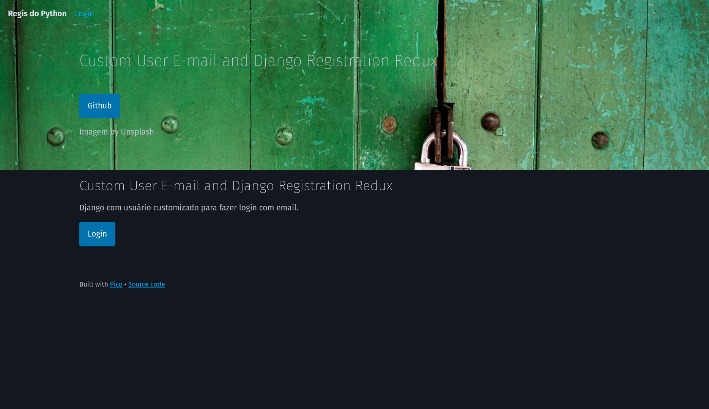
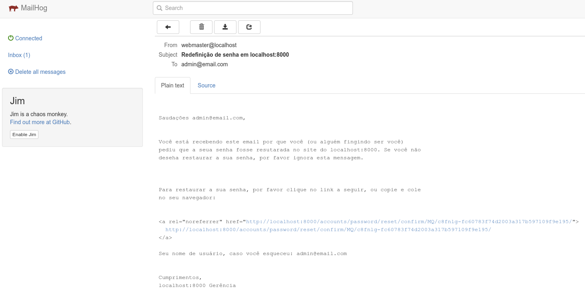

# django-custom-user-email-with-django-registration-redux

Django com usuário customizado para fazer login com email.

E usa [django-registration-redux](https://django-registration-redux.readthedocs.io/en/latest/) para fazer o gerenciamento de login, reset de senha, entre outros.


**Github:** https://github.com/macropin/django-registration

**Doc:** https://django-registration-redux.readthedocs.io/en/latest/




## Este projeto foi feito com:

* [Django 5.0.6](https://www.djangoproject.com/)
* [django-registration-redux](https://django-registration-redux.readthedocs.io/en/latest/)

## Instalação

* Clone esse repositório.
* Crie um virtualenv com Python 3.
* Ative o virtualenv.
* Instale as dependências.
* Rode as migrações.

```
git clone https://github.com/rg3915/django-custom-user-email-with-django-registration-redux.git
cd django-custom-user-email-with-django-registration-redux

python -m venv .venv
source .venv/bin/activate

pip install -r requirements.txt

docker-compose up -d

python contrib/env_gen.py

python manage.py migrate
python manage.py createsuperuser --username="admin" --email=""

python manage.py test

python manage.py runserver
```

## models.py

```python
# accounts/models.py
class User(AbstractBaseUser, PermissionsMixin):
    email = models.EmailField(_('email address'), unique=True)
    first_name = models.CharField(_('first name'), max_length=150, blank=True)
    last_name = models.CharField(_('last name'), max_length=150, blank=True)
    date_joined = models.DateTimeField(_('date joined'), auto_now_add=True)
    is_active = models.BooleanField(_('active'), default=True)
    is_admin = models.BooleanField(
        _('admin status'),
        default=False,
        help_text=_(
            'Designates whether the user can log into this admin site.'),
    )

    objects = UserManager()

    USERNAME_FIELD = 'email'
    REQUIRED_FIELDS = []

    class Meta:
        verbose_name = _('user')
        verbose_name_plural = _('users')

    def __str__(self):
        return self.email
```

## Mailhog

Acesse os e-mails em http://localhost:8025



---

Baseado em [django-custom-login-email](https://github.com/rg3915/django-custom-login-email)

<a href="https://youtu.be/dXdMD3LBUvA">
    
</a>
